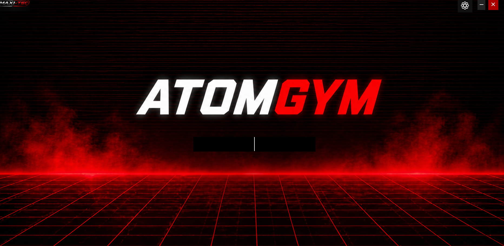
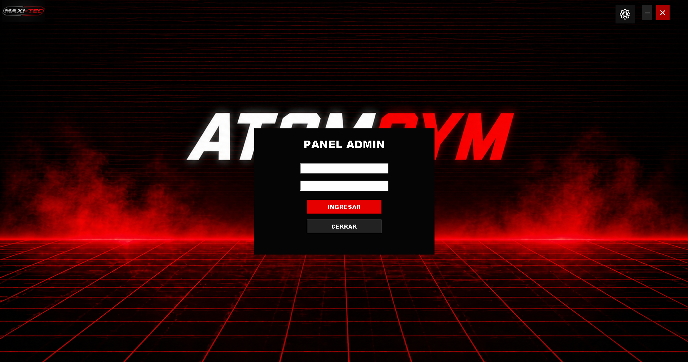
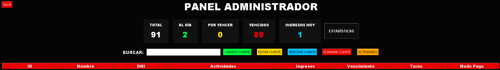
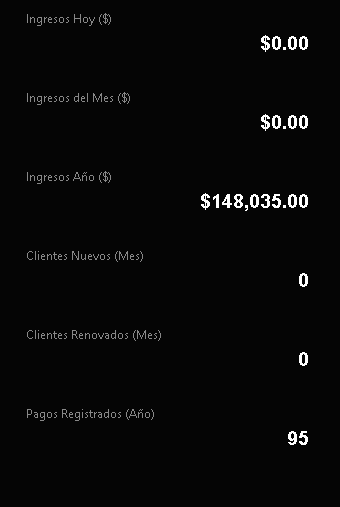
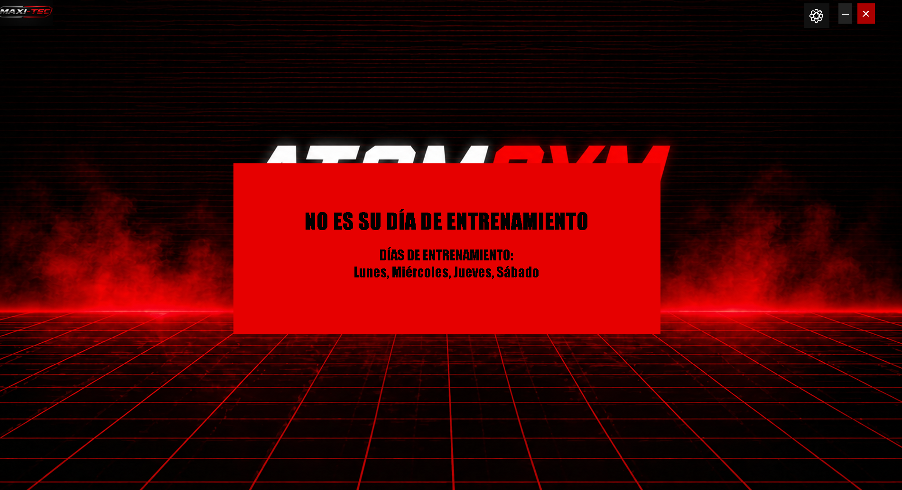

# Software de Atom GYM
Esta plataforma permite una gestión de clientes de gimnasio con una precisión que permite obtener información de tus clientes de manera oportuna:
- Control de Cuotas de clientes

  - Si está vencido tira una alarma de 3 segundos que anuncia al trabajador o dueño del estado del cliente.
    
  - Estadísticas de lo que va del mes y año de la empresa tanto financiamiento e ingresos de nuevos o viejos clientes.
 
  - Anotador automático de ingresos de cliente que permite indicar la fecha en la que venció y cuantas veces ingresó con la fecha caducada para el ingreso del gimnasio.
 
  - Permitir una organización de promos en el gimnasio limitando los horarios o turnos (Mañana, Tarde y Noche) y Días de la semana y que el consultar indique cuando no es su horario o su dia de entrenamiento.
 
# Imagenes

  

